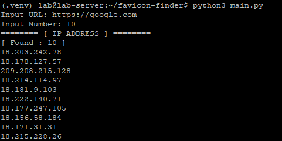

 
 # favicon-finder😎

favicon-finder is a tool designed to search for favicons and generate favicon hashes using the Criminal IP API. 
<br /> <br />

## 💙Prerequisites

- A [criminalip.io](https://www.criminalip.io/) API Key
<br />

## 💙Installation

1. Clone the repository:
   ```bash
   $ git clone https://github.com/KamilDogo/favicon-finder.git

2. Navigate to the project directory:
   ```bash
   $ cd favicon-finder

3. Install the required libraries:
   ```bash
   favicon-finder$ pip3 install -r requirements.txt


## 💙Add API Key

1. Open the configuration file:
   ```bash
   favicon-finder$ vi config/api_key.ini

2. Add your API key in the following format:
   ```bash
   [KEY1]
   APIKEY=your_api_key_here
<br />

## 💙Getting Started
   Run the main script:
   ```bash
   favicon-finder$ python3 main.py
   ```
<br />

## 💙Project Structure

The project directory structure is as follows:

| Folder/File                | Description                                                                 |
|----------------------------|-----------------------------------------------------------------------------|
| `favicon-finder/`          | Root directory                                                             |
| `├── main.py`              | Main execution file for the project                                         |
| `├── requirements.txt`     | List of libraries required to run the project in a virtual environment       |
| `├── cip/`                 | Directory for Criminal IP banner API related modules                         |
| `│   └── cip_banner_search.py` | Module to query the Criminal IP banner API and retrieve results          |
| `├── config/`              | Directory for configuration files                                           |
| `│   └── api_key.ini`      | API key file required to run the project                                     |
| `│   └── config.py`        | Module to read and validate the `api_key.ini` file according to the Criminal IP API KEY specification |
| `└── utils/`               | Directory for utility modules                                               |
| `    ├── favicon_utils.py` | Module to search favicon URLs and generate favicon hashes                   |
| `    ├── number_utils.py`  | Module to validate if the input is a number greater than 1                  |
| `    ├── response_utils.py`| Module to check the success of HTTP responses                               |
| `    └── url_utils.py`     | Module to validate URL formats                                              |
<br />

## 💙Examples
   Run the main script:
   ```bash
   $ python3 main.py
   ```
   You'll get examples like this: <br>

<br />

## 💙Inputs

| Input        | Description                                                   |
|--------------|---------------------------------------------------------------|
| **URL**      | The URL to search for the favicon.                             |
| **Number**   | The range of data sets to output (input in multiples of 10).   |

